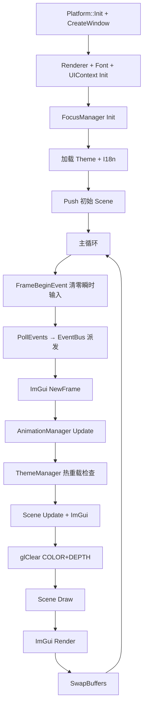

# 环境搭建

## 技术栈

| 组件 | 选择 | 用途 |
|------|------|------|
| 窗口/输入 | SDL2 2.30.x | 跨平台窗口管理、输入事件、触屏支持 |
| GL Loader | GLAD (OpenGL 3.3 Core) | 加载 OpenGL 函数指针 |
| 数学库 | GLM 1.0.1 | 向量、矩阵运算 |
| 调试 UI | ImGui (docking) | 即时模式调试面板 |
| 字体 | stb_truetype | 动态字形缓存渲染 |
| 图片 | stb_image | 纹理加载 |
| 日志 | spdlog | 控制台 + 文件日志 |
| 事件总线 | eventpp | 发布/订阅事件系统 |
| JSON | nlohmann/json | 主题/国际化配置解析 |
| BiDi 文本 | SheenBidi | Unicode 双向文本算法 |
| 3D 模型 | tinyobjloader | OBJ/MTL 模型加载 |
| 构建 | CMake 3.20+ | 跨平台构建 |

## 项目结构

```
CarHMI/
├── src/
│   ├── core/              # Application, EventBus, Property System
│   │   └── property/      # Property<T>, PropertyMap, Binding
│   ├── platform/          # Platform 抽象接口
│   │   └── sdl2/          # SDL2 实现
│   ├── scene/             # Scene, SceneManager (页面栈)
│   ├── renderer/          # 2D BatchRenderer, Shader, Texture, Font
│   ├── renderer3d/        # 3D Camera, Mesh, Renderer3D
│   ├── animation/         # Tween, Sequence, Easing, AnimationManager
│   ├── gui/               # Widget, UIContext, FocusManager
│   │   ├── widgets/       # 11 个控件
│   │   ├── layout/        # BoxLayout (VBox/HBox)
│   │   └── style/         # Theme, ThemeManager (JSON + 热重载)
│   ├── i18n/              # I18n 国际化, BiDi 双向文本
│   └── app/               # Scene 实现 + main.cpp
├── third_party/           # SDL2, GLAD, ImGui, GLM, STB, spdlog,
│                          # eventpp, nlohmann, SheenBidi, tinyobjloader
├── resources/
│   ├── shaders/           # batch2d.vert/frag, phong.vert/frag
│   ├── fonts/             # arial.ttf, consola.ttf, msyh.ttc 等
│   ├── textures/
│   ├── themes/            # dark.json, light.json
│   ├── i18n/              # en.json, zh.json, ar.json
│   └── 3d/                # OBJ 模型 + 贴图
└── docs/                  # Obsidian 学习笔记
```

## 构建方式

```bash
cmake -B build -G "MinGW Makefiles"
cmake --build build -j$(nproc)
./build/CarHMI.exe
```

## 主循环流程



## 关键设计决策

- **Platform 抽象层**：SDL2 作为可替换实现，将来可换原生 Win32/Wayland
- **EventBus**：所有输入通过事件总线分发，SubscriptionHandle 自动取消订阅
- **FrameBeginEvent**：在 PollEvents 之前清零瞬时输入状态，避免时序 bug
- **Scene 自管渲染**：每个 Scene 完全控制自己的 2D/3D 渲染流程

## 相关笔记

- [[01-OpenGL基础回顾/渲染管线概览]]
- [[02-2D渲染引擎/Batch Renderer 设计]]
- [[03-GUI框架设计/框架架构总览]]
