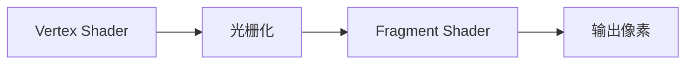

# Shader 编写笔记

## OpenGL 3.3 Shader 基础

Shader 是运行在 GPU 上的小程序，用 GLSL 编写。最基本的管线：



## Batch2D 顶点着色器

```glsl
// resources/shaders/batch2d.vert
layout(location = 0) in vec2 a_Position;
layout(location = 1) in vec4 a_Color;
layout(location = 2) in vec2 a_TexCoord;
layout(location = 3) in float a_TexIndex;

uniform mat4 u_Projection;  // 正交投影矩阵
```

`layout(location = N)` 对应 C++ 侧 `glVertexAttribPointer(N, ...)`，两边必须一致。

## Batch2D 片段着色器

```glsl
uniform sampler2D u_Textures[16];
```

GLSL 3.3 不允许用变量索引 `sampler2D` 数组，所以必须用 `switch-case`：

```glsl
switch (index) {
    case 0: texColor *= texture(u_Textures[0], v_TexCoord); break;
    case 1: texColor *= texture(u_Textures[1], v_TexCoord); break;
    // ...
}
```

> **踩坑**：如果用 `texture(u_Textures[index], ...)` 直接索引，部分驱动会编译失败或行为未定义。

## Shader 类设计

```
src/renderer/shader.h/cpp
```

- 从文件加载或内联源码
- 编译错误日志输出到控制台
- `SetUniform` 系列方法设置 uniform 变量

## 正交投影矩阵

2D 渲染用正交投影，将屏幕坐标直接映射到 NDC：

```cpp
glm::mat4 proj = glm::ortho(0.0f, (float)w, (float)h, 0.0f, -1.0f, 1.0f);
//                           left   right    bottom    top    near   far
```

注意 bottom > top，使 Y 轴向下（屏幕坐标系，0,0 在左上角）。

## 相关笔记

- [[Batch Renderer 设计]]
- [[纹理管理]]
