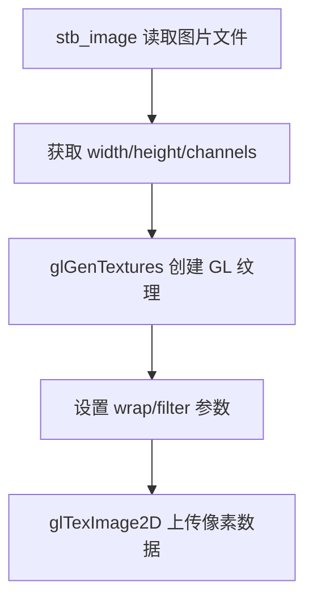

# 纹理管理

## 纹理加载流程



## Texture2D 类

```
src/renderer/texture.h/cpp
```

- `LoadFromFile(path)` — 通过 stb_image 加载
- `LoadFromMemory(data, w, h, channels)` — 直接从内存创建
- `CreateWhitePixel()` — 1x1 白色纹理，Batch Renderer 用于纯色渲染
- `Bind(slot)` — 绑定到指定纹理单元

## 通道格式

| channels | internalFormat | dataFormat |
|----------|---------------|------------|
| 1 | GL_R8 | GL_RED |
| 3 | GL_RGB8 | GL_RGB |
| 4 | GL_RGBA8 | GL_RGBA |

## 默认白色纹理的作用

Batch Renderer 的 shader 始终做 `color * texture()`。当不使用纹理时，采样 1x1 白色纹理，结果就是纯色：

```
最终颜色 = 顶点颜色 × 白色(1,1,1,1) = 顶点颜色
```

这样避免了为"有纹理"和"无纹理"写两套 shader。

## 字体图集

Font 类用 stb_truetype 将字形烘焙成一张 512x512 的纹理图集。每个字符在图集中占一小块区域，通过 UV 坐标定位：

```
+--+--+--+--+--+
| A| B| C| D|...|
+--+--+--+--+--+
| a| b| c| d|...|
+--+--+--+--+--+
```

渲染每个字符 = 一个带 sub-UV 的四边形，通过 `DrawSubTexturedQuad` 提交。

## 动态字形缓存（当前实现）

初始版本预烘焙 ASCII 32-126 共 95 个字符。当前已改为**按需加载**：

- 1024x1024 纹理图集
- 首次遇到新字符时调用 `stbtt_MakeGlyphBitmap` 烘焙到 atlas
- `DrawText` 前做 pre-pass：遍历所有字符，加载缺失的字形，然后统一上传 atlas 到 GPU
- ASCII 字符在 `LoadFromFile` 时预缓存，中文等字符按需加载
- 支持 TTC 字体集合文件（`stbtt_GetFontOffsetForIndex`）
- 支持 UTF-8 编码的多字节字符解码

```
LoadFromFile()
  ├── 预缓存 ASCII 32-126
  └── RebuildAtlas() 上传到 GPU

DrawText("你好 Hello")
  ├── Pre-pass: GetOrLoadGlyph(你), GetOrLoadGlyph(好), ...
  ├── RebuildAtlas() 如果有新字形
  └── 渲染所有字形四边形
```

> **已知问题**：中文/阿拉伯文渲染目前不显示，待专项排查。

## 3D 纹理加载

3D 模型的贴图通过 `stb_image` 加载，使用 mipmap：

```cpp
glTexImage2D(...);
glGenerateMipmap(GL_TEXTURE_2D);
```

MTL 文件中 `map_Kd` 指定漫反射贴图路径（相对于 OBJ 文件目录）。

## 相关笔记

- [[Batch Renderer 设计]]
- [[Shader 编写笔记]]
- [[../04-3D场景渲染/3D场景渲染]]
