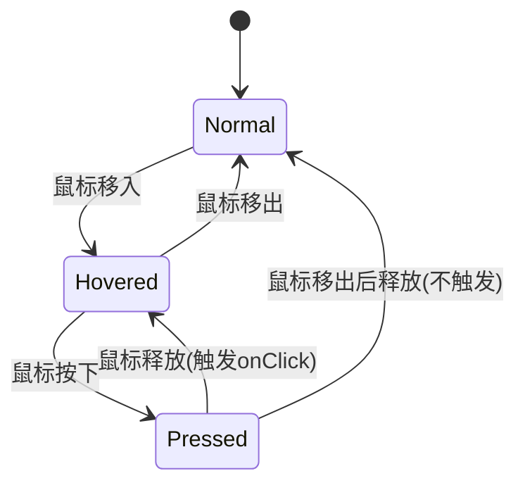

# 事件分发机制

## 输入状态管理

`UIContext` 负责收集 SDL 输入事件并维护状态：

```cpp
// 每帧开始时重置瞬时状态
ctx.BeginFrame();  // mousePressed=false, mouseReleased=false

// SDL 事件循环中传入
ctx.ProcessEvent(event);  // 更新 mousePos, mouseDown, mousePressed, mouseReleased
```

| 状态 | 含义 | 持续时间 |
|------|------|---------|
| `mouseDown` | 鼠标左键当前是否按住 | 持续到释放 |
| `mousePressed` | 本帧是否刚按下 | 仅一帧 |
| `mouseReleased` | 本帧是否刚释放 | 仅一帧 |

## Hot / Active 机制

来自 ImGui 的经典设计，用于处理点击和拖拽：

- **Hot**：鼠标悬停在控件上（每帧重新判断）
- **Active**：鼠标按下在控件上（持续到释放）

```
鼠标移入 → Hot = widget_id
鼠标按下 → Active = widget_id
鼠标移出 → Hot = 0（但 Active 不变，支持拖拽）
鼠标释放 → 如果 Active == widget_id 且 Hot == widget_id → 触发点击
```

### Button 的状态机



### Slider 的拖拽

Slider 在 `mousePressed` 时设为 Active，之后只要 `mouseDown` 就持续追踪鼠标 X 位置：

```cpp
if (ctx.GetActive() == m_id && ctx.IsMouseDown()) {
    float t = (mouseX - sliderX) / sliderWidth;  // 0..1
    m_value = min + t * (max - min);
}
```

## 事件流

```
SDL_PollEvent
  → ImGui_ProcessEvent (ImGui 先处理)
  → UIContext.ProcessEvent (更新鼠标状态)
  → Widget.Update (递归，每个控件检查自己是否被交互)
  → Widget.Draw (递归绘制)
```

## 相关笔记

- [[Retained vs Immediate Mode]]
- [[控件树设计]]
