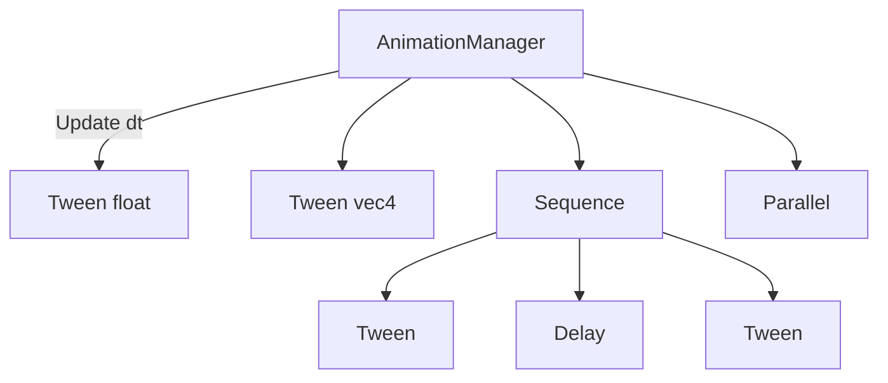

# 动画系统

## 架构



## 核心类

### Animation（基类）
所有动画的抽象接口：`Update(dt)`、`IsFinished()`、`Reset()`、`SetOnComplete()`

### Tween\<T\>（属性插值）
对任意类型的属性做 from → to 插值，支持自定义 Easing 函数。

```cpp
// 将按钮颜色在 0.15 秒内从当前值过渡到 hoverColor
AnimationManager::Get().TweenTo(&m_currentColor, hoverColor, 0.15f, Easing::OutQuad);
```

支持类型：`float`、`glm::vec2`、`glm::vec4`

### Sequence（串行）
按顺序依次执行多个动画。

### Parallel（并行）
同时执行多个动画，所有完成后才算结束。

### Delay（延迟）
等待指定时间，常用于 Sequence 中插入间隔。

## Easing 缓动函数

```
src/animation/easing.h
```

| 函数 | 效果 |
|------|------|
| Linear | 匀速 |
| InQuad / OutQuad / InOutQuad | 二次缓动 |
| InCubic / OutCubic / InOutCubic | 三次缓动 |
| InExpo / OutExpo | 指数缓动 |
| InBack / OutBack | 回弹 |
| InBounce / OutBounce | 弹跳 |
| InElastic / OutElastic | 弹性 |

## AnimationManager

全局单例，在 Application 主循环中每帧调用 `Update(dt)`。提供便捷的 `TweenTo` 和 `TweenFromTo` 方法。

## 当前应用场景

- **按钮状态过渡**：hover/press 颜色平滑渐变（0.15s OutQuad）
- **页面切换**：SceneManager push/pop 时的滑入/滑出动画

## 相关笔记

- [[../03-GUI框架设计/控件树设计]]
- [[../03-GUI框架设计/事件分发机制]]
