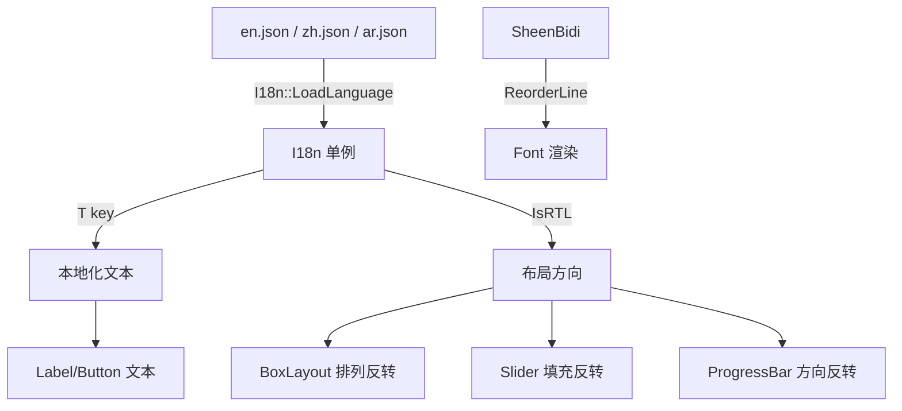

# 国际化与 RTL 支持

## 架构



## I18n 资源管理

```
src/i18n/i18n.h
```

JSON 格式的语言文件，包含名称、方向、字符串表：

```json
{
    "name": "简体中文",
    "direction": "ltr",
    "strings": {
        "app.title": "车机仪表盘",
        "btn.settings": "设置"
    }
}
```

使用方式：

```cpp
I18n::Get().LoadLanguage("zh", "resources/i18n/zh.json");
I18n::Get().SetLanguage("zh");
auto& text = I18n::Get().T("app.title");  // "车机仪表盘"
```

## RTL 布局适配

`I18n::Get().IsRTL()` 返回当前语言是否为右到左方向。

已适配的控件：
- **BoxLayout** — 水平布局在 RTL 模式下从右往左排列子控件
- **Slider** — 填充方向和手柄位置反转
- **ProgressBar** — 填充方向反转

## BiDi 双向文本

```
src/i18n/bidi.h/cpp
```

使用 SheenBidi 库实现 Unicode BiDi 算法：
- 将 UTF-8 文本转为 UTF-32
- 调用 SheenBidi 计算每个 run 的嵌入级别
- 按视觉顺序重排字符

```cpp
std::string visual = BiDi::ProcessText("مرحبا Hello عالم", true);
```

## 动态字形缓存

```
src/renderer/font.h/cpp
```

Font 支持按需加载字形（不再预烘焙全部字符）：
- 1024x1024 纹理图集
- 首次遇到新字符时烘焙到 atlas
- DrawText 前做 pre-pass 确保所有字形已加载
- 支持 TTC 字体集合文件

## 已知问题

- 中文/阿拉伯文字渲染不显示，需要专项排查（可能是字形查找或 atlas 上传问题）
- `LanguageChangedEvent` 已定义但未被订阅，语言切换需要重新进入 Scene 才生效

## 文件位置

```
src/i18n/i18n.h           — 国际化资源管理
src/i18n/bidi.h/cpp       — BiDi 双向文本处理
src/renderer/font.h/cpp   — 动态字形缓存
resources/i18n/en.json    — 英语
resources/i18n/zh.json    — 中文
resources/i18n/ar.json    — 阿拉伯语
```

## 相关笔记

- [[框架架构总览]]
- [[属性系统]]
- [[控件树设计]]
