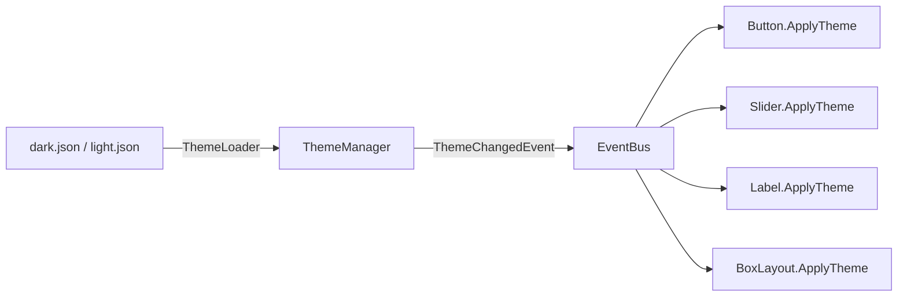

# 样式系统

## 设计目标

- JSON 文件定义主题（颜色、尺寸等）
- 运行时热重载（修改 JSON 保存后自动生效）
- 多主题切换（Dark/Light）
- 控件实时响应主题变化

## 架构



## Theme 结构体

```
src/gui/style/theme.h
```

每种控件有对应的 Style 结构体：
- `AppStyle` — 背景色
- `PanelStyle` — 面板背景色
- `LabelStyle` — textColor / titleColor / subtitleColor
- `ButtonStyle` — normal/hover/press 颜色 + 过渡时间
- `SliderStyle` — 轨道/填充/手柄颜色和尺寸
- `ProgressBarStyle` — 背景/填充/警告/危险颜色

## JSON 格式

```json
{
    "name": "Dark",
    "app": { "clearColor": [0.08, 0.08, 0.10, 1.0] },
    "button": {
        "normalColor": [0.25, 0.25, 0.30, 1.0],
        "hoverColor": [0.35, 0.35, 0.42, 1.0],
        "transitionTime": 0.15
    }
}
```

颜色用 4 元素数组 `[R, G, B, A]`，值范围 0.0-1.0。

## 热重载

ThemeManager 每 60 帧检查一次文件修改时间（`std::filesystem::last_write_time`），变化时自动重新加载并发送 `ThemeChangedEvent`。

## 控件响应机制

- Widget 基类提供 `ApplyTheme()` 虚方法和 `SubscribeThemeChange()`
- 根控件调用 `SubscribeThemeChange()` 后，主题变化时递归调用整棵树的 `ApplyThemeRecursive()`
- 通过 `SubscriptionHandle` 在 Widget 析构时自动取消订阅，避免悬垂指针

## 主题色 vs 手动色

控件支持两种模式：
- **主题色**：颜色跟随主题变化（默认行为）
- **手动色**：通过 `SetColor()` / `SetColors()` 设置后不再跟随主题

Label 通过 `Role`（Title/Subtitle/Text/Custom）区分。

## 文件位置

```
resources/themes/dark.json
resources/themes/light.json
src/gui/style/theme.h          — 结构体定义
src/gui/style/theme_loader.h   — JSON 解析
src/gui/style/theme_manager.h  — 全局管理 + 热重载
```

## 相关笔记

- [[动画系统]]
- [[事件分发机制]]
- [[控件树设计]]
